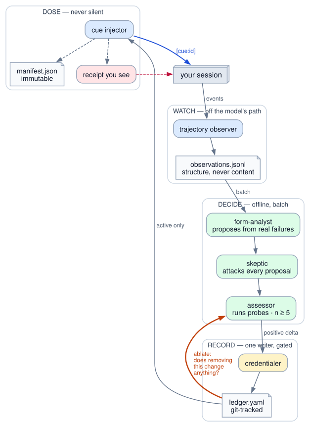
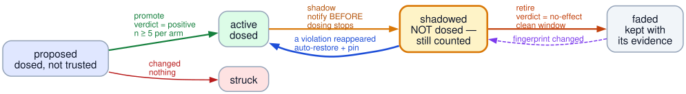
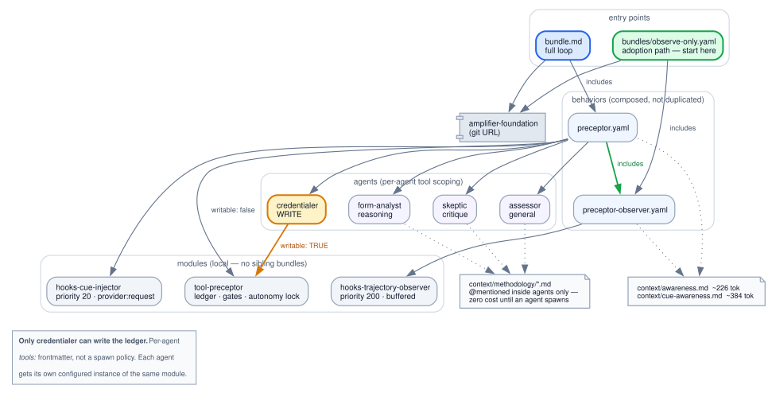

<div align="center">

# Preceptor

**Every context system can ADD instructions. Almost none can REMOVE them.**

*So nobody knows which instructions in your system prompt are still doing anything.*
*Preceptor is the instrument that measures it.*

`amplifier-core` + `amplifier-foundation` only · no sibling bundles · 71 tests

</div>

---

## An open question, not a settled one

Two claims are usually cited for "instructions accrete and should be pruned."

**Anthropic** reported removing over 80% of the Claude Code system prompt for Claude 5
generation models with no measurable eval loss. Read the primary source closely and it
contains **no methodology**: no eval names, no task counts, no confidence intervals, no
ablation procedure. It is an engineering-blog assertion, and this project used to treat it
as a result.

**The Amplifier ecosystem** cut a 15–20k token/session context bloat by hand. Real, but a
rescue rather than a measurement.

Meanwhile the **only peer-reviewed instruction-ablation study** points the other way.
[arXiv:2601.20404](https://arxiv.org/abs/2601.20404) ran agents over 10 repositories and
124 pull requests, with and without an `AGENTS.md` file:

| | With instructions |
|---|---|
| Median runtime | **28.64% lower** |
| Output tokens | **16.58% lower** |
| Task completion | comparable |

**Adding** instructions made agents measurably more efficient.

So: whether instruction removal helps is **unresolved**. One unpublished vendor claim says
yes. One peer-reviewed study on a different artifact says adding helps. Nobody has run a
systematic per-instruction ablation.

**That gap is what this bundle is for.** Preceptor is not a claim that removal helps — it
is the apparatus that can find out, and a null or negative result is a real contribution
rather than a failure.

## Why the gap exists

Every published prompt optimizer is structurally incapable of answering it:

| System | Removes instructions? |
|---|---|
| GEPA (ICLR 2026 Oral) | Incidentally — a rewrite may be shorter. No delete operator. |
| **ACE** | **Actively resists** — design goal is fighting "brevity bias" via *grow-and-refine* |
| DSPy / MIPROv2 | Rewrites instructions, selects demos. No removal. |
| TextGrad, PromptBreeder | Additive by construction |

> Every one has the same bias: fitness is task score, and instruction length is
> unconstrained. Adding a plausible instruction is free; removing a real one is risky. So
> the search drifts monotonically longer. **An optimizer only removes what its objective
> charges it for keeping.**

Preceptor charges for it.

## The loop



Watch real work. Propose a correction only from a failure that actually happened. Prove it
helps before it stays. **Then keep proving it** — and when it stops earning its place, take
it out and record why.

## The asymmetry everything else gets backwards

Most systems put the heavy evidentiary machinery on *entry* and treat removal as a reward
for good behavior. That is exactly inverted:

|  | Adding a wrong cue | Removing a right one |
|---|---|---|
| **Cost** | ~40 tokens | A failure that returns weeks later |
| **Visible?** | Yes — you see the behavior | **No — absence is invisible** |
| **You experience it as** | "why is it doing that?" | "the model got worse" |
| **Reversible?** | Trivially | In principle. Not in practice. |

So in Preceptor, **removal carries the burden of proof and addition does not.** Nothing is
ever hard-deleted. A cue is *shadowed* — dosing stops, counting continues — and only a clean
window retires it. If a violation reappears, the cue restores itself and pins.



The ratio of those restores to retirement attempts — **`false_fade_rate`** — is the system's
own trustworthiness metric. It is a gate, not a report: autonomous removal stays locked until
the rate is measured below 10% over at least 40 attempts, and it re-locks by itself if the
rate climbs.

## Quickstart

> **Apple Silicon (aarch64):** if the CLI crashes during session init with exit code 132
> and empty stderr, you have hit a known `cryptography` wheel SIGILL, not a bug in this
> bundle -- `cryptography==50.0.1`'s aarch64 build crashes during `tool-mcp` import, before
> any bundle-specific code runs. Pin the older release: `uv tool install -vv
> git+https://github.com/microsoft/amplifier --with "cryptography==45.0.7"`. Setting
> `PYTHONFAULTHANDLER=1` before reproducing surfaces a traceback rooted in
> `cryptography/exceptions.py` if you want to confirm it yourself. See `AGENTS.md`.

Start by watching. That is not ceremony — it is the thesis applied to the bundle's own
rollout.

```bash
amplifier run --bundle 'git+https://github.com/michaeljabbour/amplifier-bundle-preceptor@main#subdirectory=bundles/observe-only.yaml'
```

That bundle **records nothing.** The observer ships `enabled: false`, so the command above
verifies the bundle loads and does no more. Recording starts only when you choose the bundle
whose name says so:

```bash
amplifier run --bundle 'git+https://github.com/michaeljabbour/amplifier-bundle-preceptor@main#subdirectory=bundles/observe-on.yaml'
```

Picking that bundle *is* the consent act. There is deliberately no settings-file stanza —
an earlier draft documented one, a Digital Twin run proved it inert (no records, no error,
no way to tell which), and a consent control that fails silently is worse than none.

Run it for a couple of weeks. Read what it saw. *Then* decide whether the rest is warranted:

```bash
amplifier run --bundle git+https://github.com/michaeljabbour/amplifier-bundle-preceptor@main
```

## What you actually see

Dosing is never silent. Every session with active cues opens with a receipt:

```
preceptor: 3 cue(s) active [cue-017, cue-022, cue-031] · claude-opus-5/python-implementation · `preceptor cues`
```

| Ask | Command |
|---|---|
| What's dosed right now? | `preceptor cues` |
| **Why did it do that?** | `preceptor why <session_id>` |
| What's being recorded about me? | `preceptor observations --mine` |
| Keep this one forever | `preceptor pin <cue_id>` |
| Stop this one | `preceptor mute <cue_id \| domain \| all>` |
| Bring back something removed | `preceptor restore <cue_id>` |
| Off | `preceptor off` |
| Delete my records | `preceptor forget --since <date>` |

`why` reads an **immutable per-session manifest**, not the live ledger — so it still returns
the exact text that was dosed even after that cue has been retired and the ledger has moved
on. Without that, "why did it do that last Tuesday?" is unanswerable by construction.

## Architecture



Two entry points. One behavior chain — `preceptor.yaml` *includes* the observer rather than
duplicating it. Three local modules, no sibling bundles. Per-agent tool scoping means
`credentialer` is the only agent that can write the ledger, and that is enforced by
frontmatter, not by asking nicely in a prompt.

| Piece | Does |
|---|---|
| `hooks-trajectory-observer` | 13 kernel events → buffered, structural records. Priority 200. Never gates. |
| `hooks-cue-injector` | Doses on `provider:request`, priority 20, in its own labelled block. |
| `tool-preceptor` | The ledger, the promote/retire gates, the autonomy lock. |
| `form-analyst` · `skeptic` · `credentialer` · `assessor` | Propose · attack · record · measure. |

## Privacy, in one paragraph

The observer records **structure, not content**: which tools ran in what order, a SHA-256 of
the tool input (never the input), success flags, run boundaries. No message text, no file
contents, no error bodies, **no free-text field of any kind** — the original design had one
and it was removed, because a prose field derived from session content eventually contains
business logic, customer data, and a pasted credential. Records are local, expire on a
90-day clock, and are readable and deletable by the person they are about. See
[`docs/CONSENT.md`](docs/CONSENT.md).

## Ideas worth trying

The mechanism is more general than the bundle. If you're building on this:

- **Point it at the highest-signal event first.** `provider:tool_sequence_repaired` fires
  when a provider had to repair a malformed tool-call sequence the model produced. That is a
  pure model-form defect, already classified by the provider, requiring no judgment from you.
  It is the best cue candidate on the whole event surface and almost nobody looks at it.
- **Ablate the whole set before any single cue.** Cues interact. One large effect is
  measurable; N small ones drown in sampling noise. Anthropic's 80% cut *was* a whole-set
  ablation — the only version of this experiment anyone has run at scale, and it worked.
- **Prefer the correction turn to the probe.** How often the human says *"no, do X instead"*
  is free, continuous, hard to game, and needs no authored rubric per domain. Use probes to
  gate mutations; use correction rate as the standing signal.
- **Fingerprint the environment, not just the model.** The model is frozen. What actually
  moves is your codebase, your dependencies, your task mix — so a cue retired under one
  environment is not evidence about a different one. Invalidate on fingerprint change rather
  than waiting for the failure to recur on a user.
- **Route the learning to the right home.** A codebase gotcha belongs in project context; a
  procedure belongs in a skill; a preference belongs in memory. A model-independent fact in a
  per-model ledger will never fade correctly, because its necessity has nothing to do with the
  model.
- **Apply it to your own repo.** The 500-token context policy, the "does this earn its
  tokens?" question, the refusal to delete without evidence — those are the same discipline
  pointed inward. This repo's [`AGENTS.md`](AGENTS.md) does exactly that.

## Calibration — hill-climbing, done correctly

`bench/climb.py` searches instruction sets: propose a mutation, measure it, keep it only if
a pre-registered rule says so. It can **ADD and REMOVE**, which no published optimizer does.

The accept rule is **asymmetric**, and that is the entire design:

```
ADD     superiority     — must show a positive effect. no-effect and
                          inconclusive both REJECT. An addition earns its place.

REMOVE  non-inferiority — upper bound on the loss must sit below a
                          pre-registered margin. NOT "the drop wasn't
                          significant" — that is failure-to-reject, and an
                          underpowered test manufactures it for free.
```

**Why removals are batched.** Budget `m` removals against a total tolerable loss `Δ`, and
each gets margin `δ ≤ Δ/m`. Required n scales as `1/δ²`. Ten single removals at δ=0.5pp
needs **~37,000 paired evaluations each** — not expensive, *impossible*. One batch of ten
at δ=5pp needs ~100× fewer.

**The ratchet, and the guard against it.** A remove-capable climber where removals pass on
"no measured harm" points straight at the empty prompt: additions must clear a bar,
removals only have to fail to trip an alarm. ACE measured where that ends — context
collapsed from 18,282 tokens @ 66.7 accuracy to 122 tokens @ **57.1, below the 63.7
no-adaptation baseline**. So an **anchor** re-checks against the *original* baseline every
3 accepts and halts the run if individually-safe moves have compounded.

That anchor caught a bug in its own first implementation: the budget grew with the accept
count, so it could never fire. `test_anchor_breach_stops_the_climb` found it.

**Overfitting is structural, not advisory.** Three splits — `harvest` (propose here),
`climb` (burned), `confirm` (**sealed**; `.confirm` raises until explicitly unsealed, and
every unseal is logged). RSEA ablated exactly this gate: without it, in-sample hits **100.0
while test sits at 66.7** — a 33-point gap.

Full thresholds, hypotheses, and validity gates: [`bench/PREREGISTRATION.md`](bench/PREREGISTRATION.md).
Written before the first run, hashed, and void if it changes mid-run.

## Status — honest about what is and isn't proven

This ships **instrumentation before autonomy**, deliberately. The alternative is authoring a
cue taxonomy from priors against zero evidence, which is precisely the failure the bundle
exists to catch.

| Stage | State | Gate to the next stage |
|---|---|---|
| **v0 — observe** | Working | Detector calibrated against hand-labeled ground truth; precision/recall published |
| **v1 — dose, human-approved** | Working, **locked** | One real cue proven to retire on evidence |
| **v2 — autonomous** | Locked | `false_fade_rate < 0.10` over ≥ 40 attempts |

Things this does **not** claim: that removal helps; that earned per-model cues beat generic
ones; that a continuous loop beats a one-time human pass.
[`docs/theory/05-expert-review.md`](docs/theory/05-expert-review.md) contains the
experiment designed to embarrass this project if those claims are false — including the
sham-cue arm that tests whether "earned" means anything at all, and the `bloat` arm that
tests the thesis in the direction arXiv:2601.20404 says it may fail.

## Docs

| | |
|---|---|
| [`docs/theory/01-preceptor-thesis.md`](docs/theory/01-preceptor-thesis.md) | The argument |
| [`docs/theory/06-empirical-program.md`](docs/theory/06-empirical-program.md) | **The empirical program** — what is and isn't proven, and the experiment that settles it |
| [`bench/PREREGISTRATION.md`](bench/PREREGISTRATION.md) | Thresholds, accept rules, and validity gates, fixed before the first run |
| [`docs/theory/05-expert-review.md`](docs/theory/05-expert-review.md) | Five specialist reviews, the defects found, what changed |
| [`docs/AUTONOMY.md`](docs/AUTONOMY.md) | Why the lock exists and how it opens |
| [`docs/CONSENT.md`](docs/CONSENT.md) | What is recorded, what never is, and your controls |
| [`context/methodology/cue-lifecycle.md`](context/methodology/cue-lifecycle.md) | The state machine and every gate |
| [`context/methodology/evidence-standards.md`](context/methodology/evidence-standards.md) | What counts as evidence, and the statistical bar |
| [`AGENTS.md`](AGENTS.md) | Repo conventions + hard-won facts about the event surface |

---

<div align="center">
<sub>Diagrams are generated: <code>dot -Tsvg docs/diagrams/&lt;name&gt;.dot -o docs/diagrams/&lt;name&gt;.svg</code></sub>
</div>
